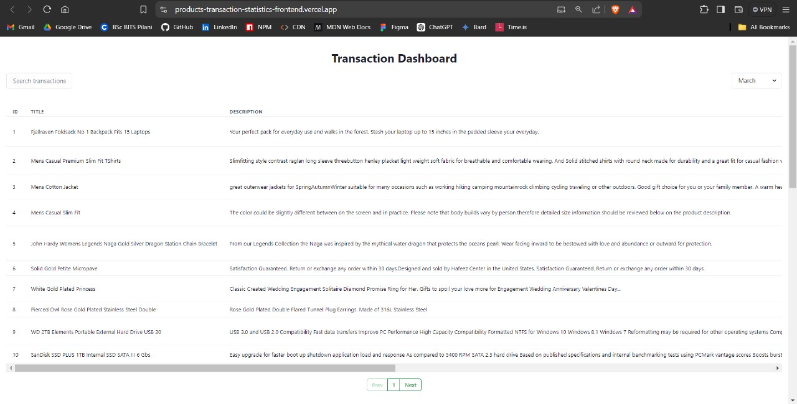
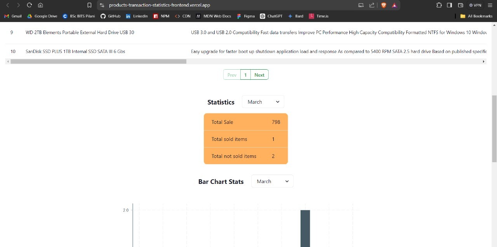
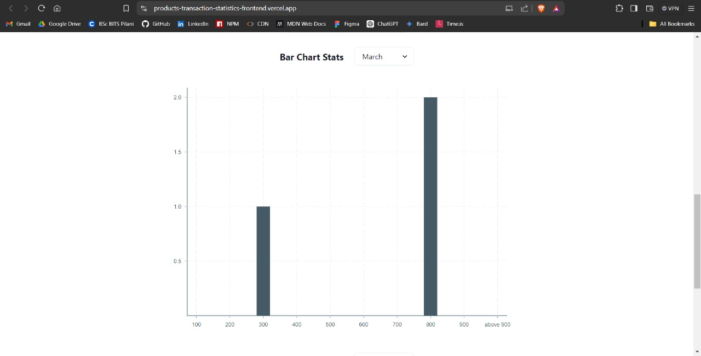
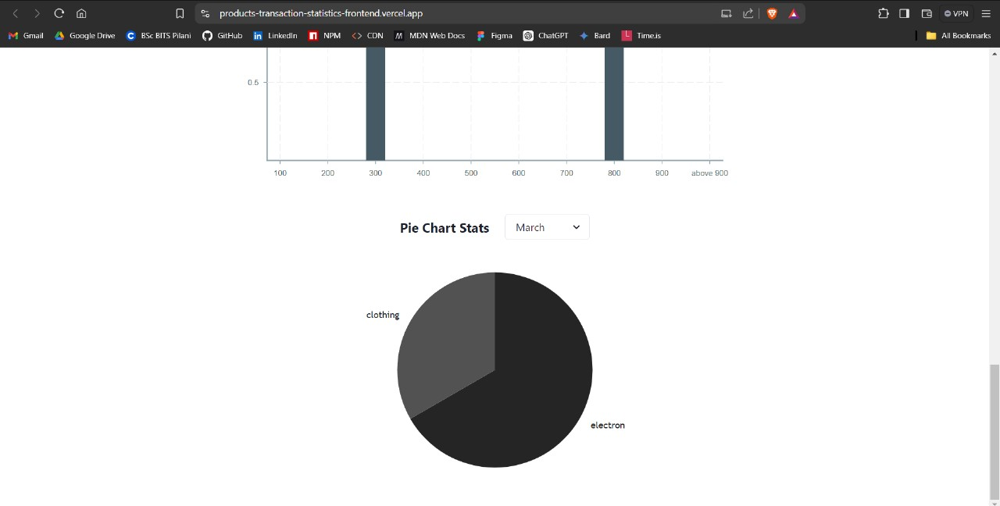

# Products Transaction App

I developed a comprehensive single-page MERN application showcasing a product transactions table alongside monthly transaction statistics. It includes dynamic visual elements such as a bar chart illustrating price ranges and item counts for the chosen month, and a pie chart presenting unique categories with corresponding item counts.

## Deployment

- [Frontend](https://products-transaction-statistics-frontend.vercel.app/)
- [Backend](https://products-transaction-statistics-backend.onrender.com)

## Features

- **Frontend**:

  - **Search Functionality**: Search transactions by title, description, or price.
  - **Transaction Table**: Displays all product transaction data with comprehensive details.
  - **Monthly Statistics**: Select a month to view statistics, bar charts, and pie charts specific to that month.
    - **Statistics**: Shows total sales amount, total sold items, and total unsold items for the selected month.
    - **Bar Chart**: Displays the price range and the number of items within that range for the selected month, irrespective of the year.
    - **Pie Chart**: Displays categories and the number of items within each category for the selected month, irrespective of the year.
  - **Responsive Design**: Ensures optimal viewing experience across all devices.

- **Backend**:
  - **Data Import API**: Imports data from `https://s3.amazonaws.com/roxiler.com/product_transaction.json` into the database.
  - **Transaction Listing API**: Lists all transactions with support for search and pagination.
    - **Search and Pagination**: Allows searching by product title, description, or price, and paginates results. If no search parameters are provided, returns all records for the specified page.
    - **Default Pagination**: Defaults to page = 1, per page = 10.
  - **Statistics API**: Provides the total sales amount, number of sold items, and number of unsold items for the selected month.
  - **Bar Chart Data API**: Returns the price range and number of items within that range for the selected month, irrespective of the year.
  - **Pie Chart Data API**: Returns unique categories and the number of items within each category for the selected month, irrespective of the year.
  - **Combined Data API**: Fetches data from the Statistics, Bar Chart Data, and Pie Chart Data APIs, combines the results, and returns a single JSON response.

## Technology Stack

List and provide a brief overview of the technologies used in the project.

- [MongoDB](https://www.mongodb.com/)
- [Mongoose](https://mongoosejs.com/docs/guide.html)
- [Express.js](https://expressjs.com/en/starter/installing.html)
- [React.js](https://reactjs.org/)
- [Context API](https://legacy.reactjs.org/docs/context.html)
- [JavaScript](https://developer.mozilla.org/en-US/docs/Web/JavaScript)
- [Axios](https://axios-http.com/docs/intro)
- [CORS](https://www.npmjs.com/package/cors)
- [Dotenv](https://www.npmjs.com/package/dotenv)
- [Nodemon](https://www.npmjs.com/package/nodemon)
- [Mongoose Paginate v2](https://www.npmjs.com/package/mongoose-paginate-v2)
- [HTML](https://developer.mozilla.org/en-US/docs/Web/HTML)
- [CSS](https://developer.mozilla.org/en-US/docs/Web/CSS)
- [Chakra UI](https://chakra-ui.com/getting-started)
- [React Icons](https://react-icons.github.io/)

## Screenshots

**Product Transactions Table**

**Statistics of Month**

**Bar Chart of Month**

**Pie Chart of Month**

## Connect with Me

- [LinkedIn](https://www.linkedin.com/in/harshalpardeshi/)
- [Email](mailto:pardeshiharshal90@gmail.com)
